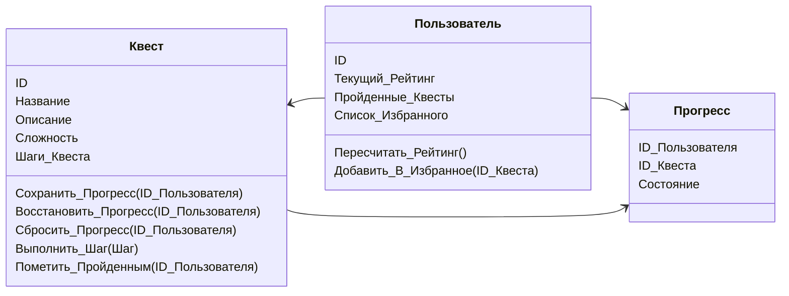

# Text Quests Player

> Хотите кофейку или секретное задание? &copy;

Плеер текстовых квестов с возможностью сохранения прогресса и рейтингом прохождения.

**Автор проекта:** Андреев Николай Владимирович

**Запустить бота:** [@SpaceRangersQuestsBot](https://t.me/SpaceRangersQuestsBot)

## Диаграмма классов

## Основные команды

|  Команда   | Описание                                             |
|:----------:|------------------------------------------------------|
|  `/start`  | Начало работы с ботом, список основных команд        |
|  `/help`   | Открыть справку и полный список команд с пояснениями |
|  `/quest`  | Выбрать квест                                        |
| `/rating`  | Открыть рейтинг                                      |

## Что умеет бот

* [ ] Вывод списка текстовых квестов с указанием уровня сложности
* [ ] Проигрывание квестов формата QM и QMM
  * [ ] Переход между локациями
  * [ ] Поддержка параметров
  * [ ] Сохранение и загрузка состояния квеста
* [ ] Формирование рейтинговой таблицы

## Панель управления

Панель управления работает через веб-интерфейс и позволяет добавлять новые квесты, изменять рейтинг игроков и просматривать текущее состояние квестов пользователей.

[Открыть панель управления](https://www.youtube.com/watch?v=dQw4w9WgXcQ)
